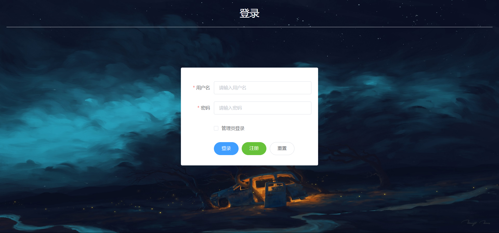
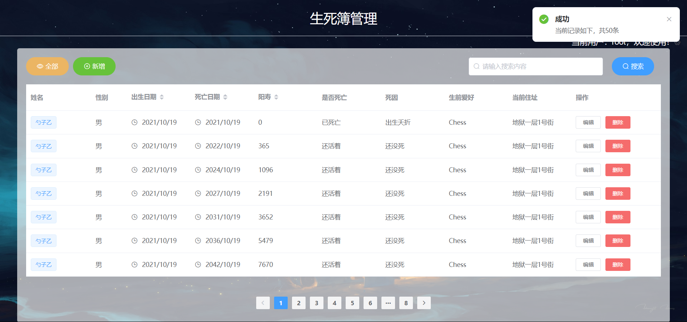
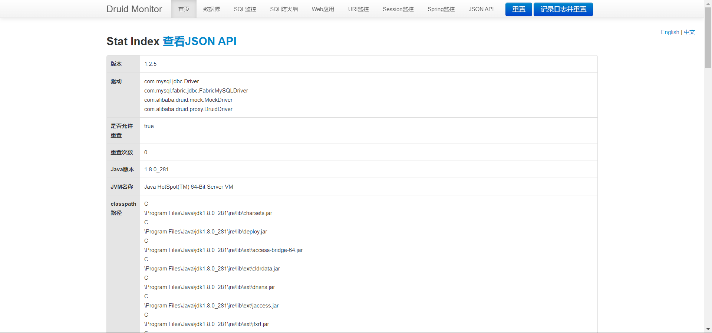

# ✨地府管理系统（SpringBoot + Vue）

普普通通的前端大作业...

第一次前后端架构分离开发尝试。

 

基本上功能都能用

没啥技术栈= =

 

# ✨界面展示

 

# ✨项目结构

- sql => 数据库
- uwms-java => 后端
- uwms-vue => 前端

 

# ✨开发环境

- MySQL 5.7
- JDK 8

 

# ✨技术栈

## 前端

- vue2
- Element UI

 

## 后端

- SpringBoot
- MybatisPlus
- Druid